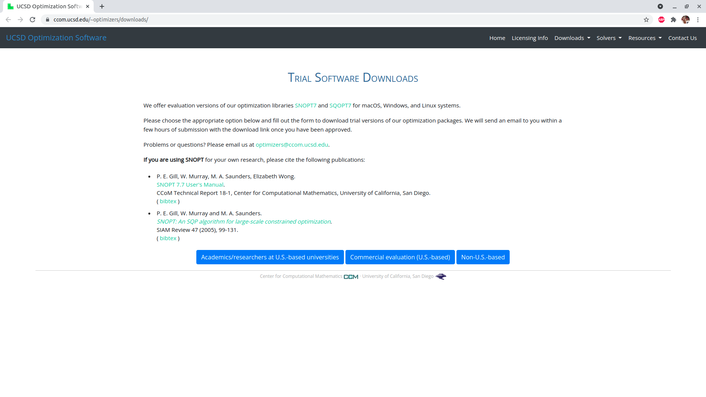
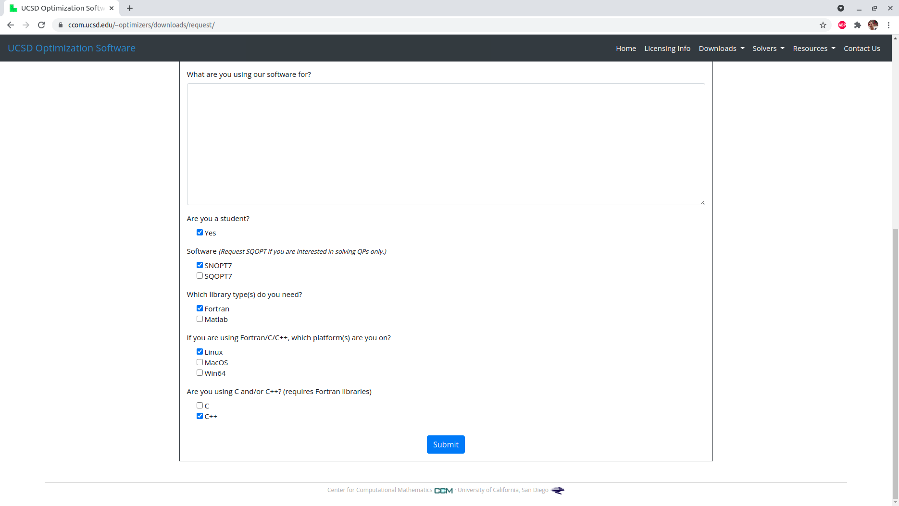
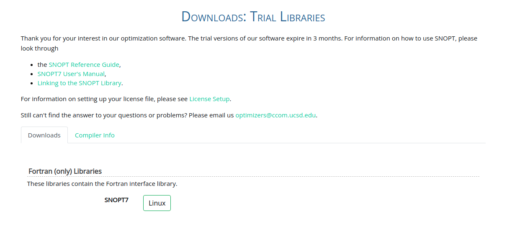

# How to install SNOPT for optimization with pagmo

This repository is a tutorial on how to install and run SNOPT for optimization using pagmo (https://github.com/esa/pagmo2). A `conda` environment is used to install both   `pagmo` and `pagmo_plugins_nonfree` (https://github.com/esa/pagmo_plugins_nonfree) with ease.

Works with Ubuntu 20.04 and `miniconda` for Python 3.9 but is yet to be tested on a fresh installation of the operating system.

(Very much inspired by https://github.com/tudat-team/tudat-bundle)

## SNOPT

### 1. Request a "Non-U.S.-based" 3-month trial license for SNOPT7 from https://ccom.ucsd.edu/~optimizers/downloads/. 



The license should be requested for Linux and should have the Fortran libraries.




### 2. Clone the repository and enter directory

```
git clone http://github.com/castanhas98/install-snopt-tutorial
cd install-snopt-tutorial
```

### 3. Initialize the submodules after the clone.

```
git submodule update --init --recursive
```
According to https://github.com/esa/pagmo_plugins_nonfree/issues/2, a very specific commit of the `snopt-interface` (https://github.com/snopt/snopt-interface/commit/76b166ecdf5c55a3289ce0f849d8d3d101954a22). However, this is handled but the command above, so there is nothing else to be done in that regard.


### 4. Install what is required for the setup of the `snopt-interface`.
```
sudo apt-get update
sudo apt-get upgrade
sudo apt-get install autoconf build-essential libtool gfortran
```

### 5. Configure the `snopt-interface` (taken from https://github.com/esa/pagmo_plugins_nonfree/issues/2#issuecomment-421500114).

```
cd snopt-interface
./autogen.sh
./configure
make snopt_c
```

After the last command, an error similar to the following will be displayed:
```
/usr/bin/ld: cannot find -lsnopt7
collect2: error: ld returned 1 exit status
make: *** [Makefile:137: lib/libsnopt7_c.la] Error 1
```
This is normal and will be solved in the coming steps. The command needs to be ran anyways to ensure the correct creation of the `/install-snopt-interface/snopt-interface/lib` directory and of some of the contents in the `/install-snopt-interface/snopt-interface/src` directory.

### 6. Download the Fortran libraries from the link provided in the email with the license. 

Some amount of time after requesting the license, an email will be sent to the registered email address. That email will contain both the license (`snopt7.lic`) and a link to the downloads, which looks like http://ccom.ucsd.edu/~optimizers/downloads/software/academic?id=XXXXXXXXXXXX. The "Fortran (only) Libraries" are the ones that should be downloaded.



 The `libsnopt7.zip` file should be extracted into `/install-snopt-tutorial/snopt-interface/lib`. Note that this directory is only generated after Step 5 is carried out.

 ### 7. Building the C libraries.

 Similarly to Step 5, the commands below are ran insed the `/install-snopt-tutorial/snopt-interface` directory.

```
make install snopt_c
```

### 8. Add the libraries to LD_LIBRARY_PATH.

For a temporary addition, that exists while the current terminal exists and that needs to be ran every time a new terminal is opened:
```
export LD_LIBRARY_PATH=`realpath ./lib`
```
or
```
export LD_LIBRARY_PATH=/absolute/path/to/snopt-interface/lib`
```
In order to avoid having to do this every time a new terminal window is opened, one can create a new `.conf` file under `/etc/ld.so.conf.d`:
```
sudo nano /etc/ld.so.conf.d/snopt.conf
```
And writing `/absolute/path/to/snopt-interface/lib` inside, which can be obtained through the `realpath` command shown above. <kbd>Ctrl</kbd> + <kbd>X</kbd>, <kbd>Y</kbd>, <kbd>Enter</kbd> to save and exit. Afterwards, run:
```
sudo ldconfig
```
to update the system with the new libraries.

### 9. Setting up the License.

The `snopt7.lic` file that is sent in the email must be saved somewhere in the computer. Assuming that it is saved under `/install-snopt-tutorial`:
```
cd ..         # to get back to the /install-snopt-tutorial directory
export SNOPT_LICENSE=`realpath ./snopt7.lic`
```

Again, a more permanent solution by adding a line to the `/etc/environment` file. Open it by doing:
```
sudo nano /etc/environment
```
and add a new line to the file with the following:
```
SNOPT_LICENSE="/absolute/path/to/snopt7.lic"
```
where `/absolute/path/to/snopt7.lic` is the absolute path to the `snopt7.lic` file. Again,  <kbd>Ctrl</kbd> + <kbd>X</kbd>, <kbd>Y</kbd>, <kbd>Enter</kbd> to save and exit. **The computer should be restarted after this step.**


### 10. Install libgfortran4
```
sudo apt-get install libgfortran4
```
In case libgfortran4 is not found, run the following commands:
```
sudo add-apt-repository universe
sudo apt-get update
sudo apt-get install libgfortran4
```

## Running SNOPT with `pagmo`

After the steps above are taken, one can create the `conda` environment in which `pagmo` and `tudat` will be installed.

### 11. Installing and activating the environment through the `environment.yaml` file.

Assuming the current directory is `/install-snopt-tutorial`:
```
conda env create -f environment.yaml
conda activate snopt-pagmo-env
```

### 12. Verify the `.cpp` file.

When using `snopt7` as a `pagmo::algorithm`, the path (absolute or relative) to the C library (the `libsnopt7_c.so` file under `/install-snopt-tutorial-snopt-interface/lib`) that was built in Step 7 must be present when the `pagmo::algorithm` is declared.

Even though the examples work as they are, it is advised to change the lines of the `.cpp` files in the repository that look like the one below
```cpp
algorithm algo(ppnf::snopt7(false, "./snopt-interface/lib/libsnopt7_c.so", 6u));
```
to
```cpp
algorithm algo(ppnf::snopt7(false, "/absolute/path/to/install-snopt-tutorial/snopt-interface/lib/libsnopt7_c.so", 6u));
```

where `/absolute/path/to/install-snopt-tutorial/snopt-interface/lib/libsnopt7_c.so` is the absolute path to the `libsnopt7_c.so` file.

### 13. Build the examples.
This step requires CMake to be installed. It can be downloaded from https://cmake.org/download/ and installed by following the instructions under "Latest Release" in the website.

Inside `/install-snopt-tutorial`, run:
```
bash build.sh
```


### 14. Run the examples.

Example 1:
```
./build/example_1
```
Which outputs:
```

```

Example 2:
```
./build/example_2
```
Which outputs:
```

```

Example 2 is very similar to the code provided in https://esa.github.io/pagmo_plugins_nonfree/quickstart.html. It must be said that that example performs the evolution in a `pagmo::archipelago` instead of in a `pagmo::population` as it is done in examples 1 and 3.

Example 3 (using Tudat):
```
./build/example_3
```
Which outputs:
```

```


## Notes
Some requirements:
- A trial version license from https://ccom.ucsd.edu/~optimizers/downloads/
- `anaconda` or `miniconda`
- `git`
- `autoconf`, `build-essential` and `libtool` packages
- g++ (pre-installed with Ubuntu 20.04)
- A Fortran compiler, we used gfortran
- `cmake`


Some thoughts:
-  Add the path with libsnopt7.so to LD_LIBRARY_PATH or to /etc/ld.so.conf.d/ create a file like snopt.conf and write the directory there. Path to directory with file, not path to file. Absolute paths from root /, not from ~
- Add SNOPT_LICENSE to /etc/environment